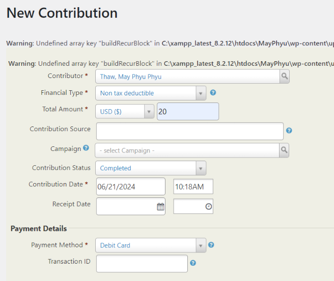
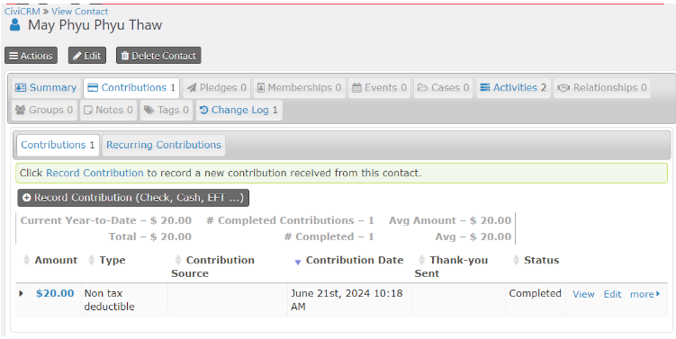
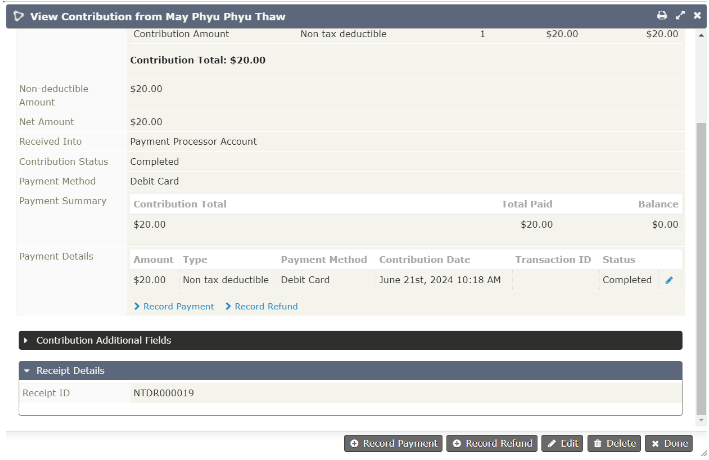

# com.octopus8.contridivide

# Objective
To generate ‘Receipt ID’ for contributions depending on the contribution types

# Overview

- Enabling this custom extension will create a custom field called “Receipt ID” for contributions.

- When a new contribution is made, the ‘Receipt ID’ will be filled with a unique ID, based on whether the ‘Financial Type’ chosen is deductible, non-deductible or donation in-kind.

- If it's tax deductible, it starts with “TDR”. If non-tax deductible, with “NTDR”. If donation in-kind, with “DIK”. The number that follows is an auto-increment that is separated from the other deductible type.

(Example: if there's an NTDR12, the new Contribution id will be NTDR13, the auto increment will not be affected by reciept id's starting with TDR)

# How to use
After installing and enabling the extension,
1. Create a contact first, and then Create a contribution

2. Choose the ‘Financial Type’ and fill in the other fields

3. Click ‘Save’ and a new contribution is created

4. Click ‘View’ or ‘Edit’ to see the ‘Receipt ID’

# Requirements
- CiviContribute

# Installation
- Download the file and drop it into your extensions folder

The extension is licensed under [AGPL-3.0](LICENSE.txt).